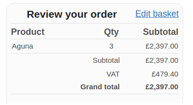

# magento-php7-taxtotals
## Abstract
This is a Magento module to solve Magento issues with adding tax totals on PHP7.

Particularly the issue i've experienced, was having a missing addition of the tax to grand total:

 
## Credits
The solution was provided by [pinkandlaces](https://community.magento.com/t5/user/viewprofilepage/user-id/160521) on https://community.magento.com/t5/Programming-Questions/Magento-Not-Adding-Taxes-To-Grand-Total/m-p/42143/highlight/true#M6178 - So this is simply the fix packed into a module.

## Background
 PHP7 has a new implementation of uasort algorithm which may behave differently for sorting elements with identical order.
